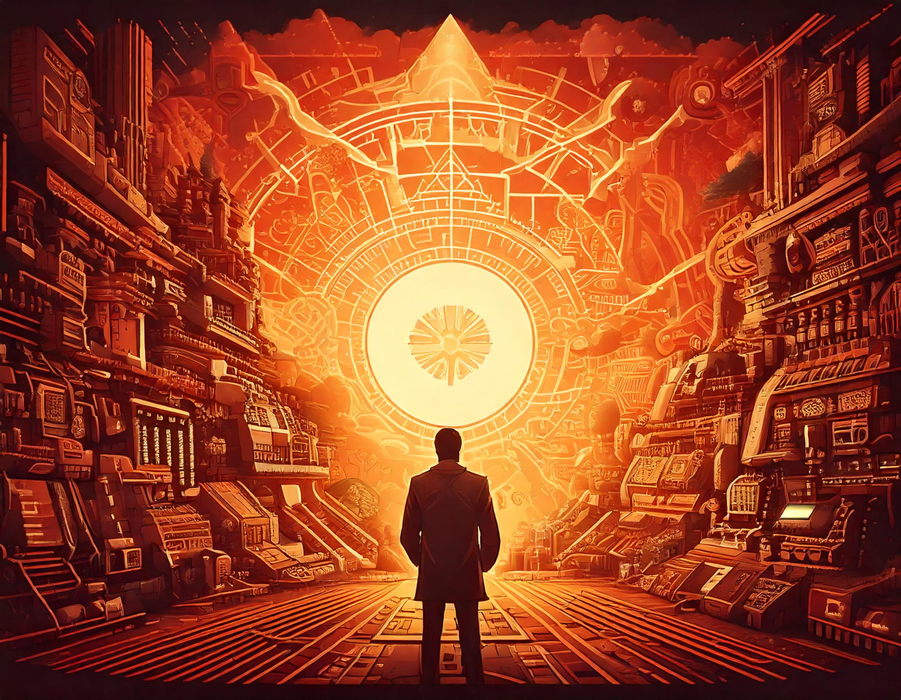

# Images for AOC 2024

The idea here is to use generative AI to generate images for each day of AOC 2024...

## Main Poster

Here are the main images for the whole AOC...

_Global Poster_

_Second Posters_

## Day 1 - Historian Hysteria

A blog post is existing for this day [here](https://blog.yalit.be/blog/2024/aoc-2024-day-01).

The prompt used for this image is:

`The Senior Historians elves ask you to find the Chief Historian. They hand a list of numbers on a paper found within the office of the Chief Historian.`
The tags used for this image are:

`Art, Tons Chauds, Eclairage Spectaculaire, Cyberpunk`

## Day 2 - Red-Nosed Reports

The prompt used for this image is:

`A man looking at weird shaped numbers handed over by nuclear elves in a nuclear fission plant`

The tags used for this image are:

`Art, Tons Chauds, Eclairage Spectaculaire, Cyberpunk`

## Day 3 - Mull It Over

The prompt used for this image is:

`A mildly flustered elf shopkeeper asks to look at the computer memory code in the warehouse office`

The tags used for this image are:

`Art, Tons Chauds, Eclairage Spectaculaire, Cyberpunk, Fantaisie, Science-Fiction`

_Version A_
-mildly_flustered_shopkeeper.jpg>)

_Version B_
-mildly_flustered_shopkeeper.jpg>)

_Version C_
-mildly_flustered_shopkeeper.jpg>)

## Day 4 - Ceres Search

The prompt used for this image is:

`Inside the CERES monitoring station, an elf ask you to look at a giant board which displays a grid of letters (X, M, A and S) intertwined`

The tags used for this image are:

`Art, Tons Chauds, Eclairage Spectaculaire, Cyberpunk, Fantaisie, Science-Fiction`

_Version A_
_elf_in_CERES.jpg>)

_Version B_
_elf_in_CERES.jpg>)

## Day 5 - Print Queue

The prompt used for this image is:

`a basement filled with multiple elves operating printing presses`

The tags used for this image are:

`Art, Tons Chauds, Eclairage Spectaculaire, Cyberpunk, Fantaisie, Science-Fiction`

_Version A_
-printing_presses.jpeg>)

_Version B_
-printing_presses.jpeg>)

## Day 6 - Guard Gallivant

The prompt used for this image is:

`An elf guard patrolling in a large suit manufacturing lab hall in 1518 seen from the first floor of the lab`

The tags used for this image are:

`Art, Tons Chauds, Eclairage Spectaculaire, Cyberpunk, Fantaisie, Science-Fiction`

_Version A_
-patrolling_guard.jpeg>)

_Version B_
-patrolling_guard.jpeg>)

## Day 7 - Bridge Repair

The prompt used for this image is:

Version _A_:

`A group of elves repairing a rope bridge standing over a river in the elf forest with young elephants in the background`

Version _B_:

`A group of elves repairing a rope bridge standing over a river in the elf forest`

The tags used for this image are:

`Art, Tons Chauds, Eclairage Spectaculaire, Cyberpunk, Fantaisie, Science-Fiction`

_Version A_
-broken_bridge.jpeg>)

_Version B_
-broken_bridge.jpeg>)
