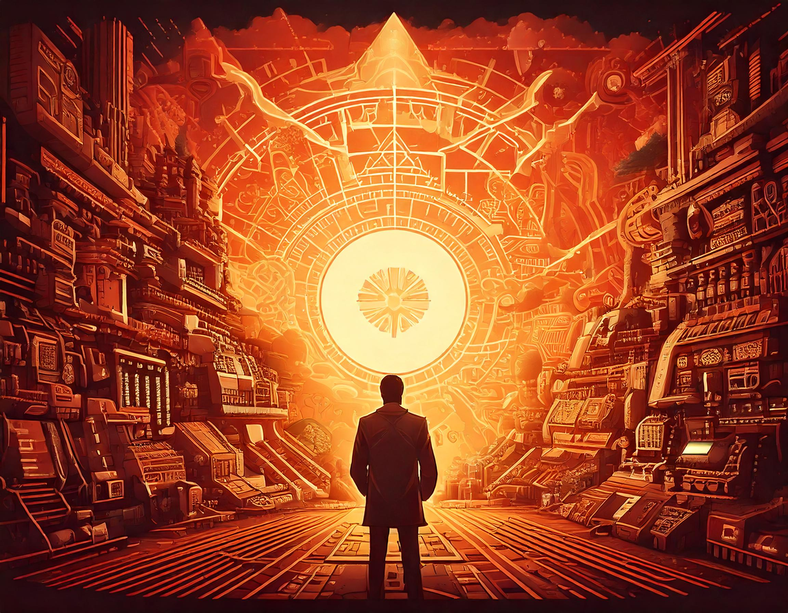
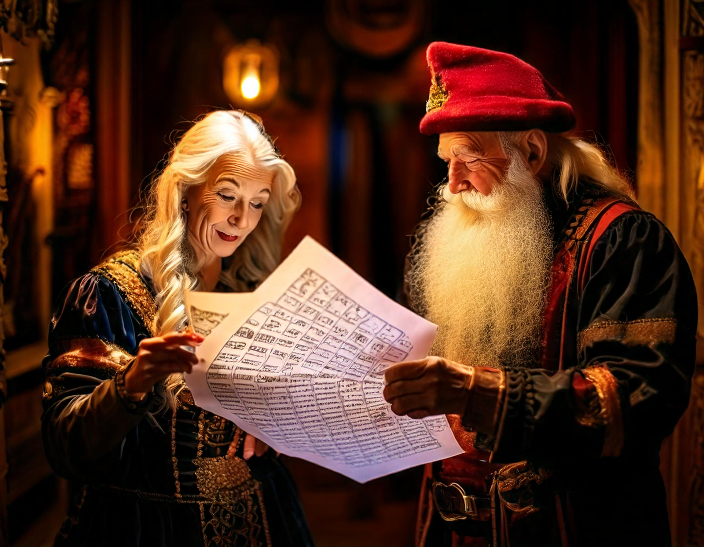
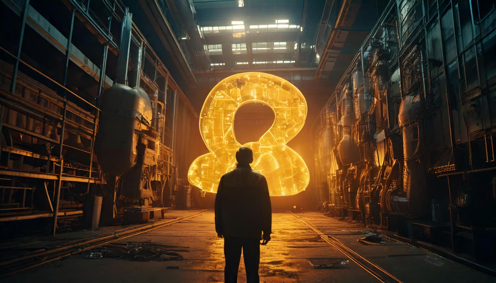
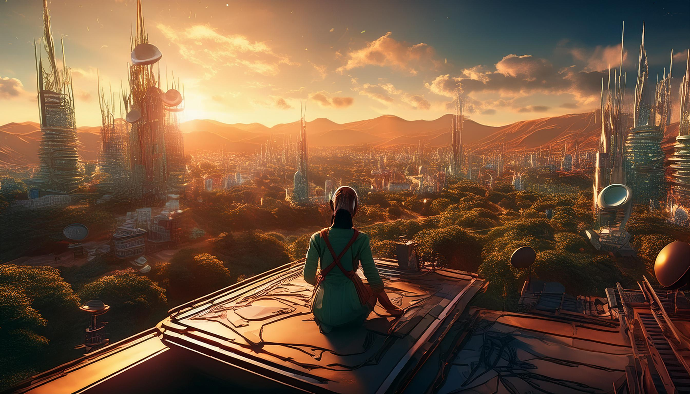
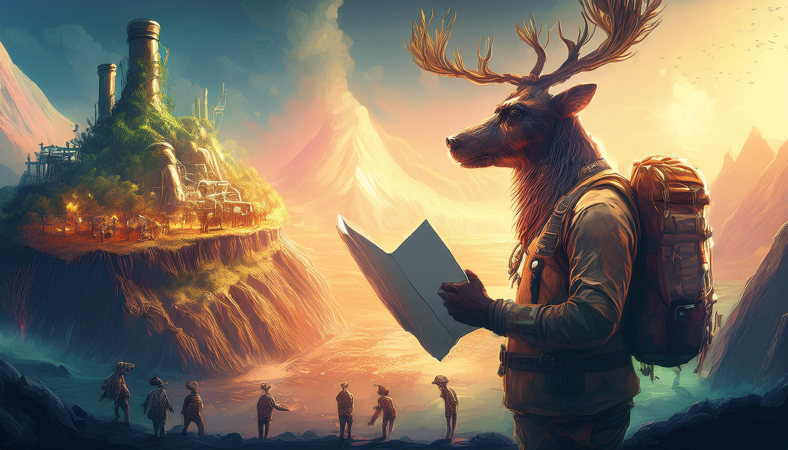
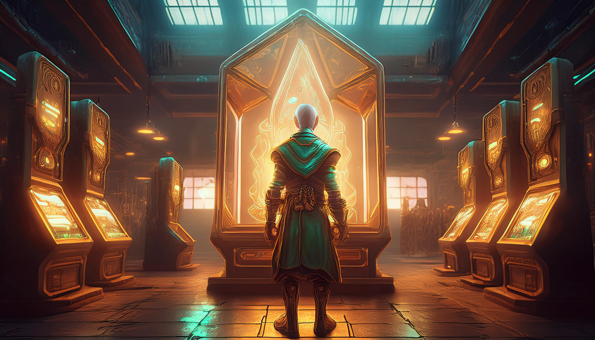

# Images for AOC 2024

The idea here is to use generative AI to generate images for each day of AOC 2024...

## Main Poster

Here are the main images for the whole AOC...

_Global Poster_

_Second Posters_

## Day 1 - Historian Hysteria

A blog post is existing for this day [here](https://blog.yalit.be/blog/2024/aoc-2024-day-01).

The prompt used for this image is:

`The Senior Historians elves ask you to find the Chief Historian. They hand a list of numbers on a paper found within the office of the Chief Historian.`
The tags used for this image are:

`Art, Tons Chauds, Eclairage Spectaculaire, Cyberpunk`

## Day 2 - Red-Nosed Reports

The prompt used for this image is:

`A man looking at weird shaped numbers handed over by nuclear elves in a nuclear fission plant`

The tags used for this image are:

`Art, Tons Chauds, Eclairage Spectaculaire, Cyberpunk`

## Day 3 - Mull It Over

The prompt used for this image is:

`A mildly flustered elf shopkeeper asks to look at the computer memory code in the warehouse office`

The tags used for this image are:

`Art, Tons Chauds, Eclairage Spectaculaire, Cyberpunk, Fantaisie, Science-Fiction`

_Version A_
-mildly_flustered_shopkeeper.jpg>)

_Version B_
-mildly_flustered_shopkeeper.jpg>)

_Version C_
-mildly_flustered_shopkeeper.jpg>)

## Day 4 - Ceres Search

The prompt used for this image is:

`Inside the CERES monitoring station, an elf ask you to look at a giant board which displays a grid of letters (X, M, A and S) intertwined`

The tags used for this image are:

`Art, Tons Chauds, Eclairage Spectaculaire, Cyberpunk, Fantaisie, Science-Fiction`

_Version A_
_elf_in_CERES.jpg>)

_Version B_
_elf_in_CERES.jpg>)

## Day 5 - Print Queue

The prompt used for this image is:

`a basement filled with multiple elves operating printing presses`

The tags used for this image are:

`Art, Tons Chauds, Eclairage Spectaculaire, Cyberpunk, Fantaisie, Science-Fiction`

_Version A_
-printing_presses.jpeg>)

_Version B_
-printing_presses.jpeg>)

## Day 6 - Guard Gallivant

The prompt used for this image is:

`An elf guard patrolling in a large suit manufacturing lab hall in 1518 seen from the first floor of the lab`

The tags used for this image are:

`Art, Tons Chauds, Eclairage Spectaculaire, Cyberpunk, Fantaisie, Science-Fiction`

_Version A_
-patrolling_guard.jpeg>)

_Version B_
-patrolling_guard.jpeg>)

## Day 7 - Bridge Repair

The prompt used for this image is:

Version _A_:

`A group of elves repairing a rope bridge standing over a river in the elf forest with young elephants in the background`

Version _B_:

`A group of elves repairing a rope bridge standing over a river in the elf forest`

The tags used for this image are:

`Art, Tons Chauds, Eclairage Spectaculaire, Cyberpunk, Fantaisie, Science-Fiction`

_Version A_
-broken_bridge.jpeg>)

_Version B_
-broken_bridge.jpeg>)

## Day 8 : Resonant Collinearity

The prompt used for this image is:

`On the roof of the elve chocolate factory overseeing a city and forest landscape filled with elves. On several high building you see antennas`

The tags used for this image are:

`Art, Tons Chauds, Eclairage Spectaculaire, Cyberpunk, Fantaisie, Science-Fiction`

## Day 9 - Disk Fragmenter

The prompt used for this image is:

`Another push of the button leaves you in the familiar hallways of some friendly amphipods! Good thing you each somehow got your own personal mini submarine. The Historians elves jet away in search of the Chief, mostly by driving directly into walls.`

The tags used for this image are:

`Art, Tons Chauds, Eclairage Spectaculaire, Cyberpunk, Fantaisie, Science-Fiction`

_Version A_
-own_submarine.jpeg>)

_Version B_
-own_submarine.jpeg>)

## Day 10 : Hoof It

The prompt used for this image is:

`You all arrive at a Lava Production Facility on a floating island in the sky. As the others begin to search the massive industrial complex, you feel a small nose boop your leg and look down to discover a reindeer wearing a hard hat. The reindeer is holding a book titled "Lava Island Hiking Guide". However, when you open the book, you discover that most of it seems to have been scorched by lava! As you're about to ask how you can help, the reindeer brings you a blank topographic map of the surrounding area (your puzzle input) and looks up at you excitedly.`

The tags used for this image are:

`Art, Tons Chauds, Eclairage Spectaculaire, Cyberpunk, Fantaisie, Science-Fiction`

## Day 11 - Plutonian Pebbles

The prompt used for this image is:

`elf counting a lot of stones with numbers on them in a large plain on Pluto`

The tags used for this image are:

`Art, Tons Chauds, Eclairage Spectaculaire, Cyberpunk, Fantaisie, Science-Fiction`

_Version A_
-counting_pebbles.jpeg>)

_Version B_
-counting_pebbles.jpeg>)

_Version C_
-counting_pebbles.jpeg>)

## Day 12 - Garden Groups

The prompt used for this image is:

`In a garden, The Historians grab something to eat while they search when some Elves ask if you can lend a hand. They set up fences around each garden plots`

The tags used for this image are:

`Art, Tons Chauds, Eclairage Spectaculaire, Cyberpunk, Fantaisie, Science-Fiction`

_Version A_

## Day 13 - Claw Contraption

The prompt used for this image is:

`with an historian elf, you are looking at a claw machine within, in the backgound, a lobby with hexagonal floor tiles`

The tags used for this image are:

`Art, Tons Chauds, Eclairage Spectaculaire, Cyberpunk, Fantaisie, Science-Fiction`

## Day 14 - Restroom Redoubt

The prompt used for this image is:

`In a warehouse, robots are moving onto a tiled floor. Some historian elves wants to enter a small door for the bathroom`

The tags used for this image are:

`Art, Tons Chauds, Eclairage Spectaculaire, Cyberpunk, Fantaisie, Science-Fiction`

## Day 15 - Warehouse Woes

The prompt used for this image is:

`In the depth of the ocean, within a mini submarine, you and the elves historians encounter a bunch of lanternfish dancing around`

The tags used for this image are:

`Art, Tons Chauds, Eclairage Spectaculaire, Cyberpunk, Fantaisie, Science-Fiction`

_Version A_
-submarine_and_lanternfishes.jpeg>)

_Version B_
-submarine_and_lanternfishes.jpeg>)

## Day 16 - Reindeer Maze

The prompt used for this image is:

`Elves in a maze where other elves are racing in a non ordered way`

The tags used for this image are:

`Art, Tons Chauds, Eclairage Spectaculaire, Cyberpunk, Fantaisie, Science-Fiction`

_Version A_
-reindeer_maze.jpeg>)

The prompt used for this image is:

`It's time again for the Reindeer Olympics! This year, the big event is the Reindeer Maze, where the Reindeer compete for the lowest score. You and The Historians arrive to search for the Chief right as the event is about to start. It wouldn't hurt to watch a little, right?`
_Version B_
-reindeer_maze.jpeg>)

## Day 17 - Chronospatial Computer

The prompt used for this image is:

`The Historians elves push the button on their strange device, but this time, you all just feel like you're falling. "Situation critical", the device announces in a familiar voice. "Bootstrapping process failed. Initializing debugger...." The small handheld device suddenly unfolds into an entire computer! The Historians elves look around nervously before one of the elves tosses it to you.`

The tags used for this image are:

`Art, Tons Chauds, Eclairage Spectaculaire, Cyberpunk, Fantaisie, Science-Fiction`

_Version A_
-chronospatial_computer.jpeg>)

The prompt used for this image is:

`The Historians push the button on their strange device, but this time, you all just feel like you're falling. "Situation critical", the device announces in a familiar voice. "Bootstrapping process failed. Initializing debugger...." The small handheld device suddenly unfolds into an entire computer! The Historians look around nervously before one of them tosses it to you.`
_Version B_
-chronospatial_computer.jpeg>)

## Day 18 - RAM Run

The prompt used for this image is:

`You and The Historian elves look a lot more pixelated than you remember. You're inside a computer at the North Pole! Just as you're about to check out your surroundings, a program runs up to you. "This region of memory isn't safe! The User misunderstood what a pushdown automaton is and their algorithm is pushing whole bytes down on top of us! Run!"`

The tags used for this image are:

`Art, Tons Chauds, Eclairage Spectaculaire, Cyberpunk, Fantaisie, Science-Fiction`

## Day 19 - Linen Layout

The prompt used for this image is:

`Elves in an onsen near hot springs`

The tags used for this image are:

`Art, Tons Chauds, Eclairage Spectaculaire, Cyberpunk, Fantaisie, Science-Fiction`

_Version A_
-onsen_bath.jpeg>)

_Version B_
-onsen_bath.jpeg>)

## Day 20 - Race Condition

The prompt used for this image is:

`The Historians elves are quite pixelated again. This time, a massive, black building looms over you - you're right outside the CPU! While The Historians elves get to work, a nearby program sees that you're idle and challenges you to a race. Apparently, you've arrived just in time for the frequently-held race condition festival for the elves!`

The tags used for this image are:

`Art, Tons Chauds, Eclairage Spectaculaire, Cyberpunk, Fantaisie, Science-Fiction`

## Day 21 - Keypad Conundrum

The prompt used for this image is:

`As you teleport onto Santa's Reindeer-class starship, The Historians elves begin to panic: someone from their search party is missing. A quick life-form scan by the ship's computer reveals that when the missing Historian elf teleported, he arrived in another part of the ship. The door to that area is locked, but the computer can't open it; it can only be opened by physically typing the door codes on they keypad next to the door`

The tags used for this image are:

`Art, Tons Chauds, Eclairage Spectaculaire, Cyberpunk, Fantaisie, Science-Fiction`

_Version A_
-keypad_combo.jpeg>)

_Version B_
-keypad_combo.jpeg>)

## Day 22 - Monkey Market

The prompt used for this image is:

`Deep in the jungle, you arrive with the Historians elves into a monkey market who buy a large amount of bananas. There are some elves buying other fruits on the market`

The tags used for this image are:

`Art, Tons Chauds, Eclairage Spectaculaire, Cyberpunk, Fantaisie, Science-Fiction`

    

 
## Day 23 - LAN Party

The prompt used for this image is:

`in the HQ, you come across posters for a LAN party scheduled for today with a lot of elves. You connect to a nearby datalink port and download a map of the local network`

The tags used for this image are:

`Art, Tons Chauds, Eclairage Spectaculaire, Cyberpunk, Fantaisie, Science-Fiction`

_Version A_
-bunny_lan.jpeg>)

_Version B_
-bunny_lan.jpeg>)

_Version C_
-bunny_lan.jpeg>)

## Day 24 - Crossed Wires

The prompt used for this image is:

`You and the Historians elves arrive at the edge of a large grove somewhere in the jungle. After the last incident, the Elves installed a small device that monitors the fruit. While The Historians elves search the grove, one of them asks if you can take a look at the monitoring device; apparently, it's been malfunctioning recently.`

The tags used for this image are:

`Art, Tons Chauds, Eclairage Spectaculaire, Cyberpunk, Fantaisie, Science-Fiction`

_Version A_
-crossed_wires.jpeg>)

_Version B_
-crossed_wires.jpeg>)

## Day 24 - Crossed Wires

The prompt used for this image is:

`In front of the Chief Historian elf's office, you find a locked door and the lock near the door is a fancy, expensive, virtual versions of five-pin tumbler lock`

The tags used for this image are:

`Art, Tons Chauds, Eclairage Spectaculaire, Cyberpunk, Fantaisie, Science-Fiction`

